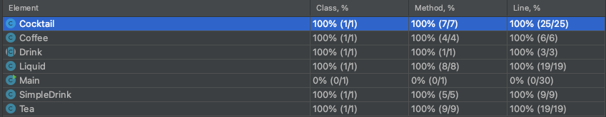

# Software Configuration Management 
Gruppe D: Lukas Becker, Andrea Heßler, David Akdogan
## Exercise 3
Division of Labour

|Lukas Becker | Andrea Heßler | David Akdogan|
--- | --- | ---
|Tests,Selling Data|Implementation of "sales"-methods in Registrierkasse.java |Seller,SellingDay Implementation|

->Bis Sonntag 18:30 fertig, dann mvn site sachen nacher machen! 

|Date | Names |Changes|
--- | --- | ---
|03.05.|Lukas Becker & Andrea Heßler|corrected Folder structure, improved POM, added first markdown files| 
|17.05|Lukas Becker & Andrea Heßler|added basic structures for this exercise, drinks now have to consist of at least one Liquid!|

- Registrierkasse.java: Calculates certain sales using the SellingData.java Class
- SellingData.java: Datastructure saving the selling Day, Seller and Drink sold for each transaction
- changes in Drink.java: ArrayList containing the Liquids a Drinks consists of, also added getter and setter methods for this, necessary for Registrierkasse.java functionality!
## Testing/Exercise 2 ## 
- 15.3.: Lukas Becker: Repo Cleanup, folder structure, created branch 
- 16.3.: David Akdogan: created branch 
- 22.4.: Lukas Becker: added tests for Cocktail and Liquids Class 
- 24.4.: Andrea Heßler: added Map-teaList in Tea.java and tests for Tea in TeaTest.java
- 24.4.: Lukas Becker: Added JavaDoc Comments and DisplayNames
- 24.4.: All: Merged branches to main
- 25.4.: Andrea Heßler: added more tests for Tea and all test for SimpleDrink
- we don't test the main
## Test Coverage 
| Class | Coverage |
---| ---|
| Cocktail | 100% |
| Coffee | 100% |
| Tea | 100% 

 
## Drinks Sample/Exercise 1 ##
### Becker Lukas: Add Cocktail.java with first implementation 
- A Drink consisting of various Liquids
- getVolume: Adds volumes of each Liquid together
- getAlcoholPercent: Average of alcohol percent from each drink
- isAlcoholic: Checks if any of the Liquids percentage is > 0
- addLiquid: Adds a Liquid
- getLiquids: returns a String array of all liquids of the cocktail

### Andrea Heßler: Add Tea.java with first implementation
- Black Tea with Rum is a special SimpleDrink
- add Drink t = new Tea to Main.java
- solve the merge conflict
- design a little better view for the output

### David Akdogan: Add Coffee.java with first implementation
- Irish Coffee with Whiskey
- Volume
- Alcohol percent
- isAlcoholic
- add Liquid: Whiskey

### Commit History

- 11.03.2021: 
  - Lukas Becker: Created Repository and added Drinks Project from elearning Platform
  - Andrea Heßler: Added her class description to readme
  - Lukas Becker: formatted readme
  - David Akdogan: Added his class description to readme
  - Lukas Becker: Added his class description to readme and reformatted readme
  - Lukas Becker: Added class "Cocktail" to project and added first methods to it. 
  
- 14.03.2021
  - Andrea Heßler: Added Tea-Class to project and implemented it in main
  - Lukas Becker: Finished Cocktail Class: added new method getLiquids, implemented Class in Main Class
  - Lukas Becker: Added method description to readme
  - David Akdogan: Added Coffee-Class and implemented it in Main Class
